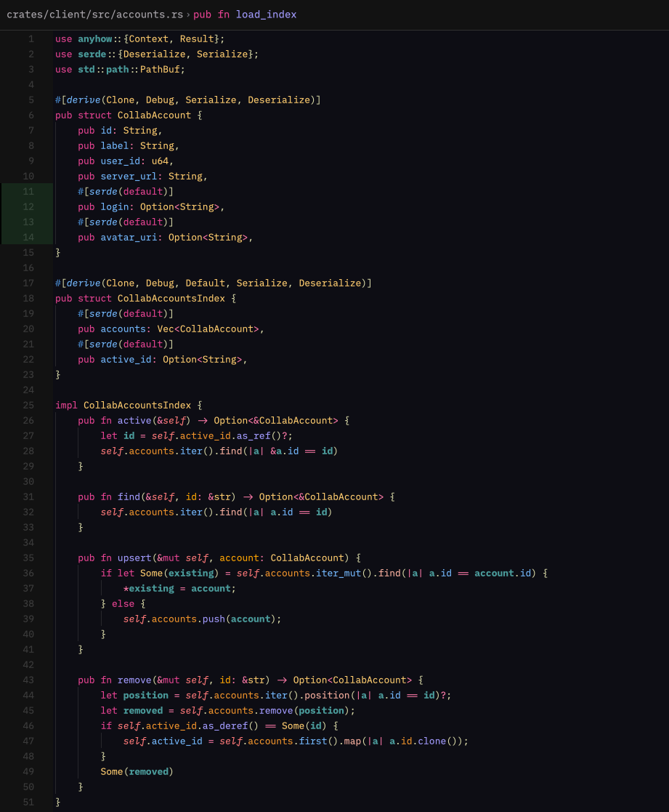
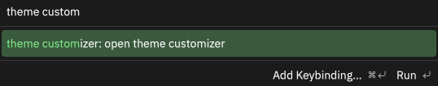
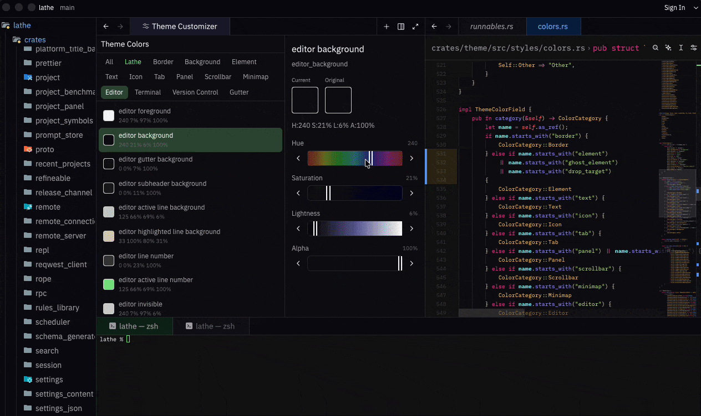
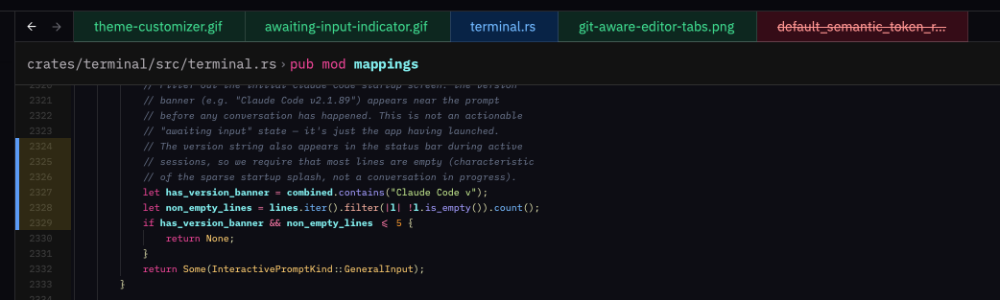
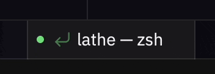

# Lathe

A customized code editor forked from [Zed](https://zed.dev), focused on better terminal workflows, visual git integration, and deep theme customization.

Lathe is a personal fork of Zed. I maintain it so I can ship small editor tweaks for my own workflow without waiting on upstream review, and without needing each change to fit Zed's product scope. Upstream Zed is the primary project - this fork tracks it closely and layers on my own changes.

**Platforms:** macOS (Apple Silicon), Linux (x86_64), and Windows (x86_64; experimental).

**Stability:** Lathe is maintained for my own daily use. Upstream syncs can occasionally introduce breakage; bug reports are welcome.

## Features

### Custom theme and syntax highlighting
Lathe ships with its own default theme and a refined syntax highlighting palette applied across all supported languages. The theme is tuned for long coding sessions - balanced contrast, distinct-but-not-loud accent colors for keywords, strings, and types, and deliberate choices for diagnostic and git-status colors so the editor stays readable when things go wrong. Pair it with the Theme Customizer (below) to tweak any of the 135+ color tokens to taste.




### Theme Customizer
A built-in panel for editing all 135+ theme colors with HSLA sliders and live preview. Includes category filters, Lathe-specific color badges, and per-color reset. Open via the command palette: `theme customizer: Open`.





### Git-aware tab and panel styling
Tabs and project panel entries are color-coded by git status — modified, created, deleted, conflict, error, and warning states each get distinct colors.



### Hierarchical branch folder tree
The Git Explorer panel renders Local and Remote branches as a collapsible folder tree, splitting names on `/`. So `feature/auth/login` and `feature/auth/signup` collapse under a single `feature/auth/` folder you can fold or expand. Folders show counts of contained branches and remember their open/closed state per section. When the filter input is active the tree flattens so filter results stay legible.

### Branch from commit
From any commit in the Git history view, create a new branch off that revision without first checking out. Useful for forking experimental work off a specific point.

### Detached HEAD checkout from history
Check out any commit SHA from the history view into detached HEAD. For inspecting old state without losing your current branch position. Local repositories only for now; collab projects bail with a clear error.

### Interactive rebase with drag-and-drop
The interactive rebase modal supports drag-and-drop reordering of commits and per-row pick / squash / edit / drop actions inline. Dragging a branch onto another in the history view shows a confirmation modal with a preview of what the rebase will do before anything runs.

### Git panel: Explorer and History tabs
The git panel has three tabs. **Changes** is the familiar staging view, **History** shows the commit log inline, and **Explorer** lists branches, worktrees, and stashes for the repository in one filterable tree. A multi-repo strip keeps every repository in the workspace one click away, with fetch-all and pull-all actions.

### Inline hunk staging
Expand any file row in the Changes list to see its individual hunks and stage or unstage them one at a time, without opening a diff view.

### Worktrees that start up to date
Creating a worktree from a remote branch fetches the latest origin state first, so the new worktree starts from the current remote tip instead of a stale local ref.

### File history view
Open the full commit history of a single file from the project panel and browse how it changed over time.

### Pull request reviews (in progress)
A pull request panel with browser-based auth for GitHub and Bitbucket Cloud: browse PRs, read and leave review comments, see reviewers, and approve or request changes. Verdict buttons toggle, so clicking Approve again retracts your approval. Hidden in the current beta while the credentials UI is finished.

### Terminal awaiting-input indicator
Shows a return icon in the terminal tab and title bar when Claude Code or other interactive prompts are waiting for input.



### Active terminal tab tint
Terminal tabs get a subtle green background when active, making them easy to spot among editor tabs.

### Terminal focus fix
Switching to a terminal tab via ctrl+tab properly activates the cursor without needing to click into the terminal.

### Terminal bell sound
Choose what sound plays when a terminal rings its bell via the `terminal.bell` setting. Imported automatically from VS Code's `accessibility.signals.terminalBell` when migrating settings.

### AI agent accounts and approval control
Sign in to multiple subscription accounts for the external agents in the Agent Panel (Claude Code, Codex, Gemini) and switch between them from the panel's account chip. An approval selector picks each agent's approval / sandbox level; the level is applied when the agent process spawns, so changes take effect on the next thread.

### Multi-account collab switcher
Sign into more than one Zed Cloud account and switch between them from the avatar menu. Saved accounts are listed under **Accounts** by their GitHub username, with **Add Account…** and **Sign Out** actions.

### Copy collab link dialog
When generating a shareable collab link, a dialog lets you pick which saved account to link from — useful when you work across personal and work Zed Cloud accounts.

### Workspace groups with account binding
Save the set of currently open projects as a named **workspace group**, then reopen the whole group in a new window later. Each group can optionally be bound to a saved collab account, so opening the group automatically switches to that account first.

Commands (via the command palette):

- `workspace groups: Save Workspace Group`
- `workspace groups: Open Workspace Group`
- `workspace groups: Update Current Workspace Group`
- `workspace groups: Rename Current Workspace Group`
- `workspace groups: Bind Workspace Group Account`
- `workspace groups: Unbind Workspace Group Account`

### Per-window zoom
`Cmd +`, `Cmd -`, and `Cmd 0` adjust the buffer and UI font size of only the active Lathe window, so two windows side-by-side can be zoomed independently. The "Reset Zoom" menu action and `Cmd +scroll-wheel` (when mouse-wheel zoom is enabled) also stay scoped to the focused window. The persisted variants (the menu's `… (persisted)` items) still write to `settings.json` and apply globally.

### Mobile (Expo / React Native) workflow
A drop-in `.zed/tasks.json` template and a setup walkthrough for building and installing Expo apps on Android devices without Android Studio. See [docs/mobile-development.md](docs/mobile-development.md). Lathe also ships a first-class Mobile panel (device list, per-app logcat, one-click debug build & run, EAS cloud builds), a status-bar device selector that appears when an Expo project is open, and a one-click Android toolchain installer that downloads JDK 17 and the Android SDK into a Lathe-managed directory with licenses accepted.

## Install

### Homebrew (recommended)

```sh
brew tap paterschris/tap
brew install --cask lathe
```

### Manual download

Download the latest release from [Releases](https://github.com/paterschris/lathe/releases):

- **macOS**: Download the `.dmg`, open it, and drag **Lathe.app** to `/Applications`. A `.zip` is also available if you prefer. macOS builds are code-signed and notarized by Apple.
- **Linux**: Download the `.tar.gz` and extract it, or use the install script after building from source (see below). Like upstream Zed, the editor needs the host's ALSA runtime (`libasound2` on Debian/Ubuntu, `alsa-lib` on Fedora/Arch) and working Vulkan drivers; both are preinstalled on typical desktop distros.
- **Windows**: Download the x86_64 setup `.exe` or `.zip`. Windows builds are currently unsigned; see [Installing on Windows](#installing-on-windows).

### Installing on Windows

The setup `.exe` is the simplest option. Because Lathe's Windows builds are unsigned, Microsoft Defender SmartScreen may show a warning. Select **More info**, verify that the file came from the Lathe GitHub release, then select **Run anyway**.

For the portable path, download the x86_64 `.zip`, open PowerShell in a Lathe source checkout, and run:

```powershell
script/install-fork-windows.ps1 -ArchivePath C:\path\to\Lathe-version-x86_64-windows.zip
```

The install script removes Mark-of-the-Web from the extracted files, installs Lathe under `%LOCALAPPDATA%\Programs\Lathe`, adds its CLI to your user `PATH`, and creates a Start Menu shortcut. If Lathe installs but no window appears, run `script/diag-windows.ps1` from the source checkout and include its output in a bug report.

### Build from source

**macOS:**

```sh
git clone git@github.com:paterschris/lathe.git
cd lathe
script/build-fork      # ~10-15 min first time
script/install-fork    # copies to /Applications
```

**Linux:**

```sh
git clone git@github.com:paterschris/lathe.git
cd lathe
script/build-fork-linux      # installs system deps, builds
script/package-fork-linux    # creates .tar.gz
script/install-fork-linux    # installs to ~/.local/share/lathe, symlinks CLI to ~/.local/bin
```

**Windows:**

```powershell
git clone https://github.com/paterschris/lathe.git
cd lathe
script/build-fork-windows.ps1 -Architecture x86_64
script/package-fork-windows.ps1 -Architecture x86_64
script/install-fork-windows.ps1
```

Installs as **Lathe** and runs alongside stock Zed without conflicts.

To run the build without installing to `/Applications`, launch the bundle directly:

```sh
open target/release/bundle/osx/Lathe.app
```

## Release channels

Lathe ships on two channels:

- **Stable** — tagged `vX.Y.Z`, the recommended build for daily use.
- **Beta** — tagged `vX.Y.Z-beta`, published as GitHub prereleases with a distinct app icon. Beta builds typically contain the latest upstream Zed sync before it's rolled into stable.

Homebrew installs stable by default. To try a beta, grab the `-beta` asset from [Releases](https://github.com/paterschris/lathe/releases).

## Updating

### Homebrew

```sh
brew upgrade lathe
```

### Manual / source (macOS)

```sh
git pull
script/build-fork
script/install-fork
```

### Manual / source (Linux)

```sh
git pull
script/build-fork-linux
script/package-fork-linux
script/install-fork-linux
```

## Relationship to Zed

Lathe periodically merges from [upstream Zed](https://github.com/zed-industries/zed) to stay current with new features and fixes. Custom changes are kept in separate commits to make merges straightforward.

**Last synced with upstream Zed: 2026-07-14.**

> **2026-04-24:** `main` was rewritten to fix a long-standing ancestry tangle that made the fork display as ~37k commits ahead and ~37k behind upstream. The new history is 9 thematic commits on top of `upstream/main`, and the source tree is unchanged. Original SHAs are preserved on the `archive/pre-rebuild-20260424` branch. Existing clones can recover with:
>
> ```sh
> git fetch origin
> git reset --hard origin/main
> ```

## License

Lathe inherits its licensing from upstream Zed:

- The application is licensed under the [GNU Affero General Public License v3.0](LICENSE-AGPL).
- `gpui` and several foundational crates are licensed under the [GNU General Public License v3.0](LICENSE-GPL).
- Other components are licensed under the [Apache License 2.0](LICENSE-APACHE).

All upstream license terms are preserved. See the individual `LICENSE-*` files at the repo root.

## Contributing

Lathe is primarily a personal fork, but I want to preserve the open-source feel of Zed. If you hit a bug, want a tweak, or have an idea that fits the spirit of the fork, feel free to open an issue or PR. See [CONTRIBUTING.md](CONTRIBUTING.md) for the inherited Zed guidelines; Lathe-specific conventions live in [CLAUDE.md](CLAUDE.md) and `.rules`.

## Releasing

```sh
script/release-fork
```

Builds, packages, and publishes a GitHub release. Requires the [GitHub CLI](https://cli.github.com/).

## Notes

- First builds take significantly longer than incremental rebuilds
- On macOS, the app shares settings and extensions with stock Zed (`~/Library/Application Support/Zed`)
- On Linux, the app installs to `~/.local/share/lathe` with the CLI symlinked to `~/.local/bin/lathe`
- `cargo-bundle` is installed automatically from [zed-industries/cargo-bundle](https://github.com/zed-industries/cargo-bundle)
