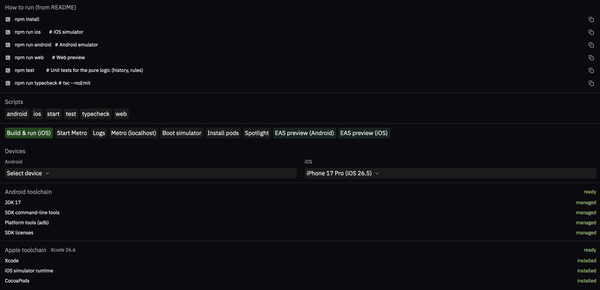
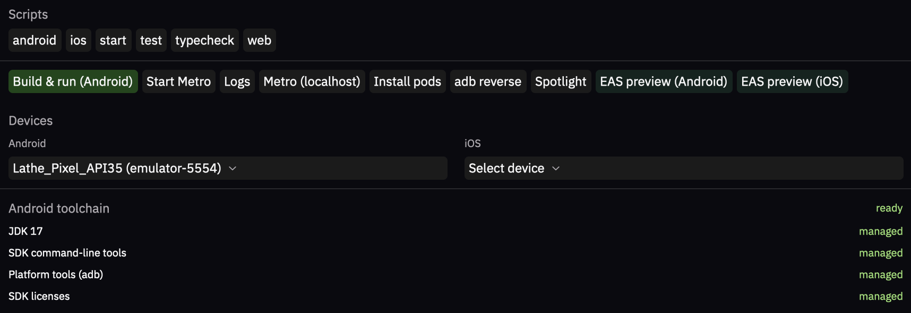
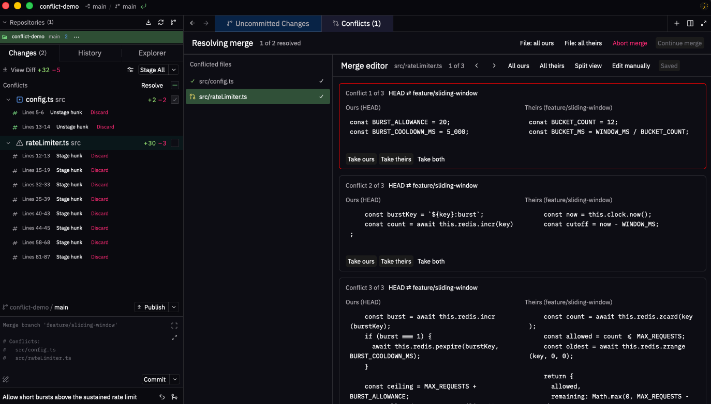
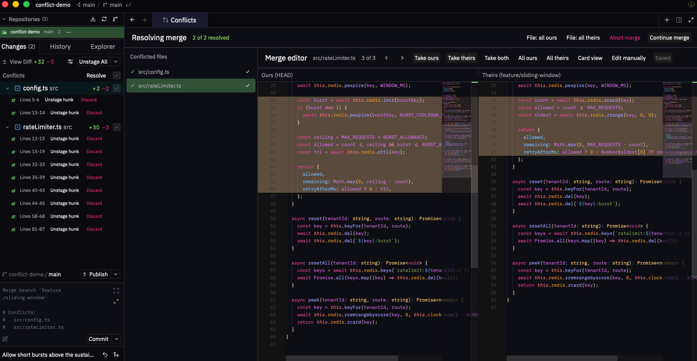
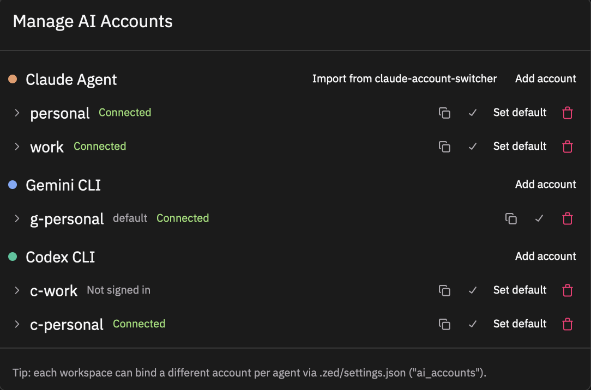

# What makes Lathe different

Lathe is a fork of [Zed](https://zed.dev). This page is the full inventory of what the fork adds or changes on top of upstream; the [README](../README.md) keeps only a summary.

It has a second audience besides users. Every entry here is fork code living alongside upstream code, and an upstream merge resolved the wrong way can drop one silently: it still compiles, nothing fails, and the feature just stops existing. That has already happened three times. When syncing upstream, this page is the checklist of what to verify still works.

Ordered by how much each one differentiates Lathe from stock Zed. Upstream already ships a commit graph, a tabbed git panel, and worktree support; the git section below covers what Lathe adds on top of those rather than restating them.

1. [Mobile development](#mobile-development-expo--react-native) - Expo and bare React Native panel
2. [Merge conflicts and interactive rebase](#merge-conflicts-and-interactive-rebase) - conflict resolution tab, full-file split view, drag-and-drop rebase
3. [Pull request reviews](#pull-request-reviews) - GitHub, GitLab, and Bitbucket, in-editor
4. [Code navigation](#code-navigation) - peek view for definitions and references
5. [AI agent integration](#ai-agent-integration) - multi-account sign-in, approval control
6. [Theme and syntax highlighting](#theme-and-syntax-highlighting) - custom theme, live 200+ color customizer
7. [Git additions](#git-additions) - explorer tab, branch tree, undo, Git Flow
8. [AWS profiles](#aws-profiles) - per-window profile selector
9. [Terminal, windows, and workspaces](#terminal-windows-and-workspaces) - awaiting-input indicator, workspace groups, per-window zoom

---

## Mobile development (Expo / React Native)

Lathe ships a first-class Mobile panel that auto-detects the kind of mobile project you open (Expo or bare React Native) and surfaces only the workflows that apply to it. For bare React Native projects it reads the project's own package scripts and the run hints in its README, offers iOS scheme and Android variant dropdowns that feed those scripts, and installs Android builds reliably with `gradlew :app:install<Variant>` plus an `adb` launch (sidestepping the React Native CLI's flavored-APK bug). Long-running processes (Metro, builds, and any script you start) open as interactive terminal tabs with their own scrollback. The panel can also create Pixel phone and Pixel Tablet Android virtual devices (AVDs) without Android Studio, shows a live device list with per-app logcat, drives one-click debug build & run and EAS cloud builds, and installs the whole Android toolchain (JDK 17 plus the Android SDK, licenses accepted) into a Lathe-managed directory. On macOS it covers iOS as well. A drop-in `.zed/tasks.json` template and a full setup walkthrough live in [docs/mobile-development.md](mobile-development.md).

Both toolchain sections report their own state, so a missing JDK or an unaccepted SDK license is visible before a build fails rather than after. The action row follows the platform you're targeting: an iOS project offers **Boot simulator** and **Install pods**, while an Android one swaps in **adb reverse** and builds against whichever emulator or device is selected.

---

## Merge conflicts and interactive rebase

### Conflict reporting and resolution
When a merge, rebase, cherry-pick, revert, pull, or stash pop stops on conflicts, a notification names the conflicted files and offers **Resolve**, which opens a tab listing every conflicted file beside the merge editor for the selected one. Resolve a whole file as ours or theirs, stage files as you finish them, and abort or continue the operation from the same header without dropping to a terminal. The same tab is reachable any time from the git panel's Conflicts section or `git: resolve conflicts`.

### Merge conflict editor with full-file split view
Resolve conflicts with **Take ours** / **Take theirs** / **Take both** per conflict, or step through them with previous/next navigation. A **Split view** toggle switches between per-conflict cards and full-file panes. The split view shows each side as a complete file (every conflict region replaced by that side's kept content), scrolls both panes in lockstep, and highlights the selected conflict across them. "Edit manually" drops you into the buffer when the buttons aren't enough.

### Interactive rebase with drag-and-drop
The interactive rebase modal supports drag-and-drop reordering of commits and per-row pick / squash / edit / drop actions inline. Dragging a commit or branch onto another in the commit graph shows a confirmation modal with a preview of what the rebase will do before anything runs.

---

## Pull request reviews

A pull request panel for GitHub, GitLab, and Bitbucket, including GitHub Enterprise and self-hosted GitLab: browse PRs, read and leave review comments, see reviewers and CI status, and approve or request changes without leaving the editor. GitHub and Bitbucket Cloud sign in through the browser; enterprise hosts and GitLab take a personal access token. Verdict buttons toggle, so clicking Approve again retracts your approval. A checks chip summarizes the host's CI for the branch - passed, failed, or still running, with counts - so you can see whether a PR is worth reviewing yet.

Every git repository in the workspace gets its own collapsible section, headed by the repository name and its open count, so a workspace holding a backend and a frontend shows both at once rather than whichever happens to be active.

Beyond reviewing, you can request reviewers, merge or squash and merge, move a PR between draft and ready, and close or reopen it. On a pull request you didn't open, those author-only actions sit under a **More** menu instead of the button row, so a merge or a decline is never one stray click away from a review verdict. A separate section lists PRs you authored, with reviewer roll-ups showing where each one stands. The panel button can be hidden via `pull_request_panel.button`.

---

## Code navigation

Go to Definition, Declaration, Implementation, Type Definition, and Find All References open a peek: an inline block below the cursor line holding the list of locations beside a preview of the selected one, in the manner of VS Code's peek view. These used to open a multibuffer in a new tab, which took you out of the file you were reading to answer a question about it. Peek is now the default for all five, and cmd-click and alt-cmd-click route through it as well. The divider between the list and the preview can be dragged; its position carries to later peeks and persists across restarts.

The list is virtualized, so a symbol with thousands of references doesn't lay out thousands of rows on every frame. The peek also takes a `menu` key context, which keeps Vim's normal-mode `j` and `k` on the peek list rather than driving the editor behind it.

Set `lsp_results_location` to `multi_buffer` or `picker` to go back to a tab or a filterable picker instead.

---

## AI agent integration

### Prompt history in the composer

Up and down in the agent panel's composer walk the prompts you have already sent, the way a shell walks its command history. The keys only take over at the edges of the text: on the first display row for up, the last for down, so navigating within a multi-line prompt still moves the cursor normally. The editors for past and queued messages deliberately keep plain cursor movement, since swapping their content out from under an edit would be surprising.

### Agent accounts and approval control
Sign in to multiple subscription accounts for the external agents in the Agent Panel (Claude Code, Codex, Gemini) and switch between them from the panel's account chip. Account selection is per-workspace, so a work project and a personal project can each stay on their own identity. An approval selector picks each agent's approval / sandbox level; the level is applied when the agent process spawns, so changes take effect on the next thread. Agents with their own native approval control keep it and skip the selector.

**Manage AI Accounts** lists every account for each agent alongside its connection status, lets you nominate a default per agent, and can import existing logins from `claude-account-switcher`. Individual workspaces bind their own account per agent via `ai_accounts` in `.zed/settings.json`.

---

## Theme and syntax highlighting

### Custom theme and syntax palette
Lathe ships with its own default theme and a refined syntax highlighting palette applied across all supported languages. The theme is tuned for long coding sessions: balanced contrast, distinct-but-not-loud accent colors for keywords, strings, and types, and deliberate choices for diagnostic and git-status colors so the editor stays readable when things go wrong.

### Theme Customizer
A built-in panel for editing all 200+ theme colors, including syntax token colors, with HSLA sliders and live preview. Includes category filters, Lathe-specific color badges, and per-color reset. Open via the command palette: `theme customizer: open theme customizer`.

---

## Git additions

Zed already ships the commit graph, the tabbed git panel, and worktree support. Everything below is what Lathe layers on top.

### Explorer tab and hierarchical branch folder tree
Lathe adds a third **Explorer** tab to the git panel, alongside upstream's Changes and History. It lists branches, worktrees, and stashes for the repository in one filterable tree, and renders Local and Remote branches as a collapsible folder tree that splits names on `/`. So `feature/auth/login` and `feature/auth/signup` collapse under a single `feature/auth/` folder you can fold or expand. Folders show counts of contained branches and remember their open/closed state per section. Local branches that exist on the remote get an on-remote indicator. When the filter input is active the tree flattens so filter results stay legible. A multi-repo strip keeps every repository in the workspace one click away, with fetch-all and pull-all actions, plus any external repositories pinned via `repository_dashboard_pinned_repos`.

### Undo for destructive operations
Branch resets, deletes, renames, and tag creation record an undo entry, and the resulting toast offers a one-click **Undo**. Discards stash defensively first, so they can be restored too. Up to 50 entries are kept per repository.

### Git Flow commands
Start and finish feature, release, and hotfix branches from the command palette. Finishing merges with `--no-ff` into the right target, tags releases and hotfixes, merges back into `develop`, and deletes the local branch. Failures surface as errors rather than half-completing silently.

- `git flow: start feature` / `git flow: finish feature`
- `git flow: start release` / `git flow: finish release`
- `git flow: start hotfix` / `git flow: finish hotfix`

### Branch from commit
From any commit in the history view or graph, create a new branch off that revision without first checking out. Useful for forking experimental work off a specific point.

### Detached HEAD checkout from history
Check out any commit SHA from the history view into detached HEAD. For inspecting old state without losing your current branch position. This now works on remote and collab projects as well as local ones, though the collab path ships without a test, since the fork has no remote-git test harness.

### Worktrees that start up to date
Creating a worktree from a remote branch fetches the latest origin state first, so the new worktree starts from the current remote tip instead of a stale local ref.

### File history view
Open the full commit history of a single file from the project panel and browse how it changed over time.

### Git-aware tab and panel styling
Tabs and project panel entries are color-coded by git status: modified, created, deleted, conflict, error, and warning states each get distinct colors.

### Inline hunk staging
Expand any file row in the Changes list to see its individual hunks and stage or unstage them one at a time, without opening a diff view.

### Branch status indicator and git activity panel
The status bar shows the active repository's branch with its push/pull state. A separate git activity panel (docked bottom by default) shows in-flight git commands live, so long fetches and clones aren't invisible.

---

## AWS profiles

A status-bar AWS profile selector, scoped per window, so two windows can target different accounts at once. Everything Lathe spawns (terminals, tasks) inherits the selected `AWS_PROFILE`. The menu shows only profiles you've used in this workspace, with the rest behind **Show All Profiles**, and it polls SSO session status so an expired login is visible before a command fails. A project-local `.aws/config` takes over from the global one when present. The whole selector stays hidden unless the machine actually has AWS profiles configured.

The same menu creates a new SSO profile through a wizard, opens the AWS config file for editing, appends a `credential_process` wrapper profile for tooling that still expects SDK v2 credentials, and deactivates the current selection.

---

## Terminal, windows, and workspaces

### Awaiting-input indicator
Shows a return icon in the terminal tab and title bar when Claude Code or other interactive prompts are waiting for input, with the tooltip distinguishing a general prompt, a confirmation, and a multiple-choice selection.

### Active terminal tab tint
Terminal tabs get a subtle green background when active, making them easy to spot among editor tabs.

### Terminal focus fix
Switching to a terminal tab via ctrl+tab properly activates the cursor without needing to click into the terminal.

### Workspace groups with account binding
Save the set of currently open projects as a named **workspace group**, then reopen the whole group in a new window later. Each group can optionally be bound to a saved collab account, so opening the group automatically switches to that account first. Groups can also be written to a portable `.lathe-workspace` file that travels with the project.

Commands (via the command palette):

- `workspace groups: save workspace group`
- `workspace groups: open workspace group`
- `workspace groups: update current workspace group`
- `workspace groups: rename current workspace group`
- `workspace groups: bind workspace group account`
- `workspace groups: unbind workspace group account`

### Per-window zoom
`Cmd +`, `Cmd -`, and `Cmd 0` zoom every piece of text in the active Lathe window together: the editor, terminal, project panel, git panel, git graph, pull requests, agent panel, git commit editor, and markdown preview. The zoom is scoped to that window, so two windows side-by-side can be zoomed independently. The "Reset Zoom" menu action and `Cmd +scroll-wheel` (when mouse-wheel zoom is enabled) behave the same way. Upstream Zed only zooms the editor with these keys and gives the agent panel and markdown preview their own independent zoom; Lathe folds those into the single window zoom. The persisted variants (the menu's `… (persisted)` items) still write to `settings.json` and apply globally.

### Multi-account collab switcher
Sign into more than one Zed Cloud account and switch between them from the avatar menu. Saved accounts are listed under **Accounts** by their GitHub username, with **Add Account…** and **Sign Out** actions.

### Copy collab link dialog
When generating a shareable collab link, a dialog lets you pick which saved account to link from, which helps when you work across personal and work Zed Cloud accounts.
