# What makes Lathe different

Lathe is a fork of [Zed](https://zed.dev). This page is the full list of what the fork changes or adds on top of upstream. The [README](../README.md) just carries the summary.

There's a second reason this page exists. Every entry below is fork code sitting right next to upstream code, and an upstream merge resolved the wrong way can quietly delete one: it still compiles, nothing fails, the feature is just gone. That's happened three times now. So when I sync upstream, this is the checklist of what to go verify.

Roughly ordered by how far each one is from stock Zed. One caveat on the git entry: upstream already has a commit graph, a tabbed git panel, worktree support, and single-file history, so that section only covers what Lathe puts on top of them.

1. [Mobile development](#mobile-development-expo--react-native) - a panel for Expo and bare React Native projects
2. [Merge conflicts and interactive rebase](#merge-conflicts-and-interactive-rebase) - a conflict resolution tab, full-file split view, drag-and-drop rebase
3. [Pull request reviews](#pull-request-reviews) - GitHub, GitLab, Bitbucket, in the editor
4. [Code navigation](#code-navigation) - definitions and references open in a peek instead of a new tab
5. [AI agent integration](#ai-agent-integration) - multi-account sign-in, approval control
6. [Theme and syntax highlighting](#theme-and-syntax-highlighting) - the default theme, plus a live customizer for all 200+ colors
7. [Git additions](#git-additions) - explorer tab, branch tree, undo, Git Flow
8. [Jupyter notebooks](#jupyter-notebooks) - a setting you can flip, instead of upstream's server-side feature flag
9. [Terminal, windows, and workspaces](#terminal-windows-and-workspaces) - extra windows for editors and terminals, an awaiting-input indicator, workspace groups, per-window zoom
10. [AWS profiles](#aws-profiles) - a per-window profile selector

---

## Mobile development (Expo / React Native)

Lathe has a Mobile panel that works out what kind of project you opened, Expo or bare React Native, and shows only the workflows that apply to it.

For bare React Native it reads the project's own package scripts plus whatever run hints are in its README, then gives you iOS scheme and Android variant dropdowns that feed into those scripts. Android installs go through `gradlew :app:install<Variant>` and an `adb` launch, which sidesteps the React Native CLI's flavored-APK bug. Anything long-running (Metro, builds, any script you kick off) opens as an interactive terminal tab with its own scrollback.

The panel will also create Pixel phone and Pixel Tablet AVDs without Android Studio, keep a live device list with per-app logcat, drive one-click debug build & run and EAS cloud builds, and install the entire Android toolchain for you: JDK 17, the Android SDK, licenses accepted, all into a directory Lathe manages. On macOS it does iOS too. There's a drop-in `.zed/tasks.json` template and a full setup walkthrough in [docs/mobile-development.md](mobile-development.md).

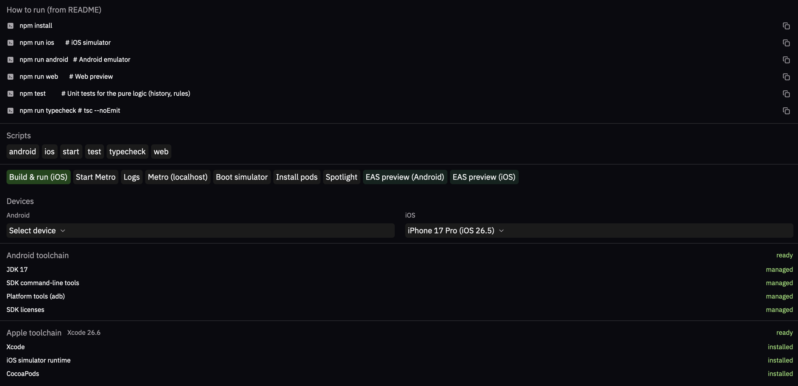

Both toolchain sections report their own state, so you hear about a missing JDK or an unaccepted SDK license before a build fails instead of after. The action row follows whichever platform you're targeting: iOS gets **Boot simulator** and **Install pods**, Android swaps those out for **adb reverse** and builds against the emulator or device you've selected. Targets aren't exclusive either. An Android emulator and an iOS simulator can both be running, and both can take a build and deploy in the same pass. Physically connected devices show up in that same list, so live testing on real hardware doesn't mean leaving the editor either.

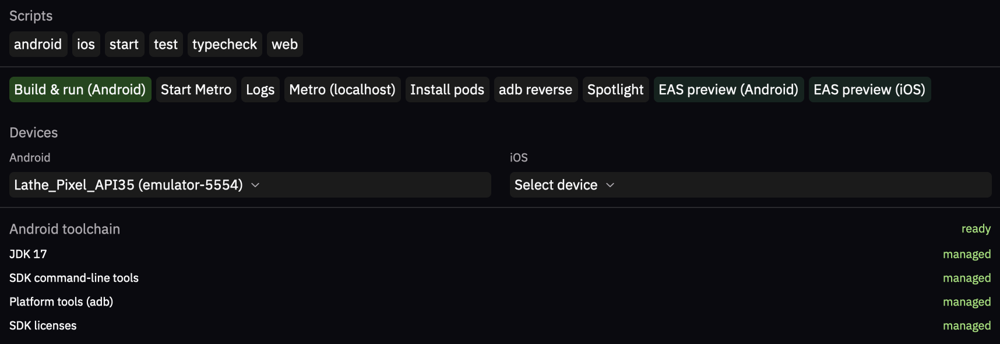

---

## Merge conflicts and interactive rebase

### Conflict reporting and resolution
A merge, rebase, cherry-pick, revert, pull, or stash pop that stops on conflicts gets you a notification naming the conflicted files, with a **Resolve** button on it. That opens a tab listing every conflicted file beside the merge editor for whichever one is selected. Resolve a whole file as ours or theirs, stage files as you finish them, abort or continue the operation from the same header. No dropping to a terminal. The same tab is reachable any time from the git panel's Conflicts section, or `git: resolve conflicts`.

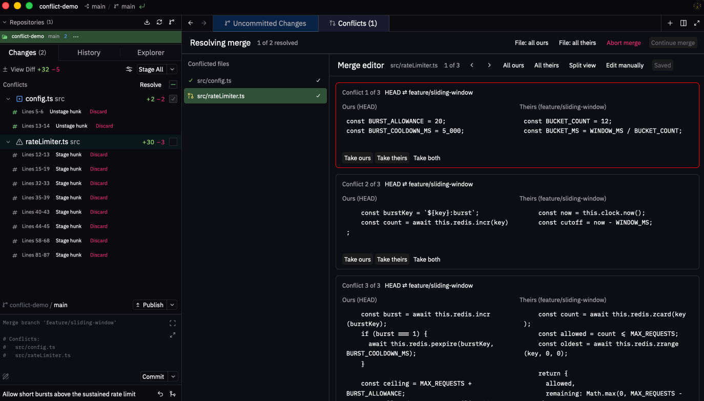

### Merge conflict editor with full-file split view
**Take ours** / **Take theirs** / **Take both** per conflict, or step through them with previous/next navigation. A **Split view** toggle flips between per-conflict cards and full-file panes. In split view each side is shown as a complete file, every conflict region replaced by that side's kept content, and the two panes scroll in lockstep with the selected conflict highlighted across both. When the buttons aren't enough, "Edit manually" drops you into the buffer.

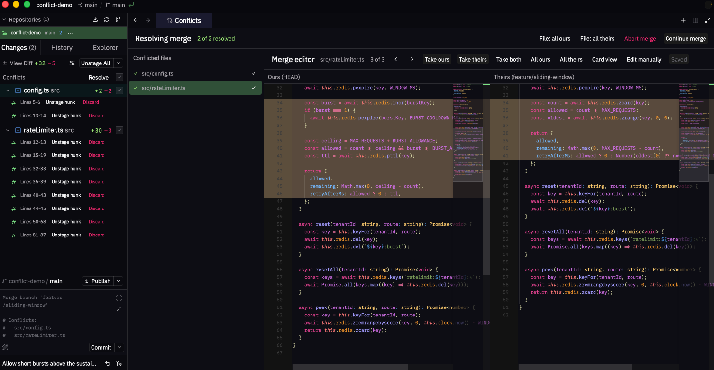

### Interactive rebase with drag-and-drop
The interactive rebase modal does drag-and-drop reordering, with pick / squash / edit / drop inline on each row. Drag a commit or a branch onto another one in the commit graph and you get a confirmation modal previewing what the rebase will do before anything runs. Select a range of commits in the graph and the context menu offers **Squash N commits into one** and **Interactive rebase N commits onto here**, so a history cleanup pass starts from the graph you were already reading. Not from `git rebase -i` and an editor session.

---

## Pull request reviews

A pull request panel for GitHub, GitLab, and Bitbucket, including GitHub Enterprise and self-hosted GitLab. Browse PRs, read and leave review comments, check reviewers and CI status, approve or request changes, all without leaving the editor. GitHub and Bitbucket Cloud sign in through the browser; enterprise hosts and GitLab want a personal access token. Verdict buttons toggle, so hitting Approve a second time retracts your approval. A checks chip sums up the host's CI for the branch, passed or failed or still running with counts, which tells you whether a PR is even worth opening yet.

Every git repository in the workspace gets its own collapsible section, headed by the repo name and its open count. So a workspace holding a backend and a frontend shows you both at once instead of whichever one happens to be active.

Past reviewing: request reviewers, merge or squash and merge, flip a PR between draft and ready, close it or reopen it. On a pull request you didn't open, those author-only actions live under a **More** menu instead of in the button row, so a merge or a decline is never one stray click away from a review verdict. There's a separate section for PRs you authored, with reviewer roll-ups showing where each one stands. `pull_request_panel.button` hides the panel button if you don't want it.

---

## Code navigation

Go to Definition, Declaration, Implementation, Type Definition, and Find All References all open a peek: an inline block below the cursor line holding the list of locations beside a preview of the selected one, in the manner of VS Code's peek view. These used to open a multibuffer in a new tab, which took you out of the file you were reading in order to answer a question about it. Peek is now the default for all five, and cmd-click and alt-cmd-click route through it as well. You can drag the divider between the list and the preview; where you leave it carries to later peeks and survives a restart.

The list is virtualized, so a symbol with thousands of references doesn't lay out thousands of rows on every frame. The peek also takes a `menu` key context, which keeps Vim's normal-mode `j` and `k` on the peek list and off the editor behind it.

Want the old behavior back? `lsp_results_location` set to `multi_buffer` or `picker` gets you a tab or a filterable picker instead.

---

## AI agent integration

### Prompt history in the composer

Up and down in the agent panel's composer walk back through prompts you've already sent, the way a shell walks its command history. History is scoped per thread and per workspace, so switching threads switches which prompts you're walking instead of pooling every prompt you've ever typed. The keys only take over at the edges of the text, on the first display row for up and the last for down, so the cursor still moves normally inside a multi-line prompt. Editors for past and queued messages keep plain cursor movement on purpose: swapping their content out from under an edit would be a nasty surprise.

### Per-workspace thread history

Archived agent threads show up in Thread History for the current workspace, sorted chronologically. Restoring one puts it back in that workspace's thread list.

### Agent accounts and approval control
Sign into multiple subscription accounts for the external agents in the Agent Panel (Claude Code, Codex, Gemini) and switch between them from the panel's account chip. Account selection is per-workspace and switching takes effect at runtime, so a work project and a personal project can each sit on their own identity and their own subscription, which keeps plan usage and rate limits from bleeding between them. An approval selector picks each agent's approval / sandbox level; that level is applied when the agent process spawns, so a change lands on the next thread. Agents with their own native approval control keep it and skip the selector.

**Manage AI Accounts** lists every account for each agent alongside its connection status, lets you nominate a default per agent, and can import existing logins from `claude-account-switcher`. A workspace binds its own account per agent through `ai_accounts` in `.zed/settings.json`, though you rarely need to open that file. The account chip's menu covers the same ground: switch to another account, clear the binding for the current workspace, add an account, open the manager.

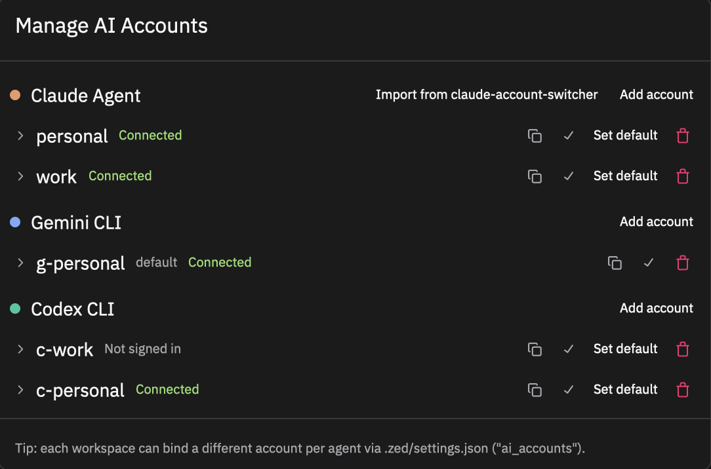

### Agent settings in the composer
Each agent's own settings sit inline in the composer, and the row adapts to the agent instead of showing some lowest-common-denominator set. Codex gets sandbox access, model, reasoning effort, and a fast-mode toggle. Claude Agent gets permission mode, model, thinking level, and its own fast-mode toggle.

When approval and sandbox level take effect depends on the agent, because the two paths are genuinely different. Codex and Gemini receive theirs as launch arguments (`-c approval_policy=` and `-c sandbox_mode=` for Codex, `--approval-mode` for Gemini), so **Full access** and its siblings bind when the thread's agent process spawns and a change applies to the next thread. Claude Agent has native mode support and goes over ACP `session/set_mode`, so **Bypass permissions** takes effect on the thread you're already in. Model, thinking level, and fast mode apply as you go, no new thread needed.

---

## Theme and syntax highlighting

### Custom theme and syntax palette
Lathe ships its own default theme, plus a refined syntax highlighting palette applied across every supported language. It's tuned for long coding sessions: balanced contrast, accent colors for keywords, strings, and types that are distinct without being loud, and deliberate choices for the diagnostic and git-status colors so the editor stays readable when things go wrong.

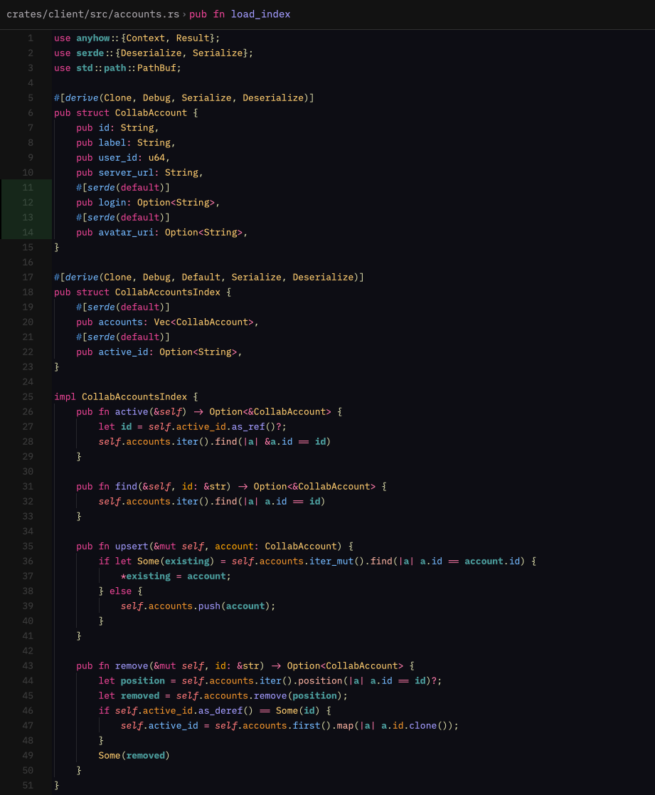

### Theme Customizer
A built-in panel for editing all 200+ theme colors, syntax token colors included, with HSLA sliders and live preview. Category filters, Lathe-specific color badges, per-color reset. Open it from the command palette: `theme customizer: open theme customizer`.

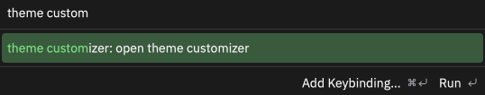

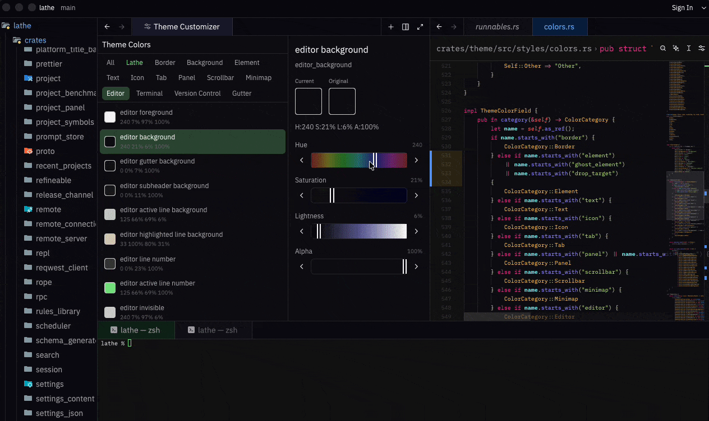

---

## Git additions

Zed already ships the commit graph, the tabbed git panel, worktree support, and the `git: file history` action. Everything below is what Lathe layers on top.

### Explorer tab and hierarchical branch folder tree
Lathe adds a third **Explorer** tab to the git panel, next to upstream's Changes and History. It lists the repository's branches, worktrees, and stashes in one filterable tree, and renders Local and Remote branches as a collapsible folder tree that splits names on `/`. So `feature/auth/login` and `feature/auth/signup` fold up under a single `feature/auth/` folder. Folders show counts of the branches they contain and remember their open/closed state per section. Local branches that also exist on the remote get an on-remote indicator. Turn on the filter input and the tree flattens, which keeps filter results legible. Clicking a branch opens the commit graph and navigates to that branch, so the tree and the graph stay in step. A multi-repo strip keeps every repository in the workspace one click away, with fetch-all and pull-all actions, plus any external repositories you pin via `repository_dashboard_pinned_repos`.

### Branch and commit context menus
Right-click a branch: checkout, **Branch from here**, copy branch name, merge into the current branch, rebase the current branch onto it, delete. Right-click a commit and you additionally get tag creation, cherry-pick onto the current branch, drop, revert, the three reset modes, rebase onto that commit, and copy of the full or short SHA. Menu labels name the branch they're about to act on instead of saying "the current branch", so a reset reads as **Reset main to here (hard, discard changes)** before you click it. Not after.

### Undo for destructive operations
Branch resets, deletes, renames, and tag creation all record an undo entry, and the toast you get afterward has a one-click **Undo** on it. Discards stash defensively first, so those can be restored too. 50 entries kept per repository.

### Git Flow commands
Start and finish feature, release, and hotfix branches from the command palette. Finishing merges with `--no-ff` into the right target, tags releases and hotfixes, merges back into `develop`, and deletes the local branch. If something fails it surfaces as an error instead of half-completing quietly.

- `git flow: start feature` / `git flow: finish feature`
- `git flow: start release` / `git flow: finish release`
- `git flow: start hotfix` / `git flow: finish hotfix`

### Branch from commit
Create a new branch off any commit in the history view or the graph without checking it out first. Handy for forking experimental work off a specific point.

### Detached HEAD checkout from history
Check out any commit SHA from the history view into detached HEAD, for poking at old state without losing your place on the current branch. This works on remote and collab projects now as well as local ones, though the collab path ships without a test, since the fork has no remote-git test harness.

### Worktrees that start up to date
Creating a worktree from a remote branch fetches the latest origin state first, so the new worktree starts at the current remote tip and not a stale local ref.

### Git status colors on tabs by default
Upstream colors tab labels by git status behind `tabs.git_status`, off by default. Lathe turns it on, and keeps the label readable once the row is selected: a selected tab or project panel entry falls back to the default label color instead of tinting into its own selection background.

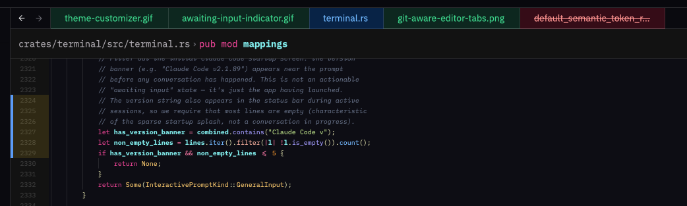

### Inline hunk staging
Expand a file row in the Changes list to get its individual hunks, and stage or unstage them one at a time without opening a diff view.

### Branch status indicator and git activity panel
The status bar shows the active repository's branch and its push/pull state. A separate git activity panel (docked bottom by default) shows git commands as they run, so a long fetch or clone isn't invisible.

---

## Jupyter notebooks

Upstream gates its notebook editor behind the server-side `notebooks` feature flag, so stock Zed will only open `.ipynb` files for accounts that flag has been enabled for. Lathe swaps that gate for an ordinary setting, `jupyter.notebook_enabled`, and puts it in the settings UI under **Languages and Tools > Jupyter Notebooks** as **Enable Experimental Notebook Editor**. So turning it on doesn't mean hand-editing JSON or waiting to get flagged.

Turning it back off needs a restart.

Past the setting, Lathe fixes things in the editor itself. The ones worth knowing about:

**Saving no longer eats your notebook.** Upstream rebuilt each cell's outputs from whatever it had rendered, which meant images, tables, JSON and markdown outputs were dropped on every save, and widgets went with them. Opening a notebook and saving it now reproduces the file. Cell source round-trips exactly too, so an untouched notebook produces an empty `git diff` instead of a whole-file rewrite.

**More outputs actually render.** SVG (matplotlib's svg backend, graphviz), GIF, and LaTeX used to come out as the literal text "Unsupported media type". Plotly and Bokeh were worse: they send HTML whose content lives in a `<script>` tag, the markdown converter strips scripts, and you got an empty box even though the kernel had also sent a perfectly good PNG. That PNG now wins.

**Cells share one document.** Every cell used to be an island with no project attached, which is why nothing in a cell had completions. They're now excerpts over a single buffer holding the whole notebook as a script, so a name defined in cell 1 is in scope in cell 2. Zed only attaches language servers to buffers backed by a real file, so completions need `jupyter.language_server_sidecar` turned on as well; that writes a hidden `.yourfile.lathe.py` next to the notebook and deletes it on close. Add `.*.lathe.*` to your `.gitignore` if you use it.

**A source view.** `notebook::ToggleSourceView` (`cmd-shift-y`) flips between the cells and the whole notebook as one `# %%`-separated script, the jupytext format. Both views edit the same document, so there's nothing to sync and no second file to get stale. Editing the script and switching back rebuilds the cell list; cells that still line up keep their ids and outputs.

**Diffs you can read.** `.ipynb` is JSON, so a one-line change hides among escaped strings and re-running a cell rewrites kilobytes of base64. Both sides are converted to source before diffing, so outputs never reach the comparison and re-running a notebook shows nothing at all. Hunks appear in each cell's own gutter. If you'd rather not commit outputs in the first place, `jupyter.clear_outputs_on_save` strips them on the way out.

**The rest.** `cmd-f` works. `cmd-shift-o` lists cells by their markdown heading or first definition. Breadcrumbs tell you which cell you're on out of how many. Go-back returns to the cell you were on rather than the top. Moving a cell actually redraws.

It's still experimental, and honestly so: none of it has been through a proper visual pass, the kernel status icon doesn't spin while a kernel is busy, and the sidecar hasn't been checked against a real language server. It's off by default for a reason. If you hit something, file it.

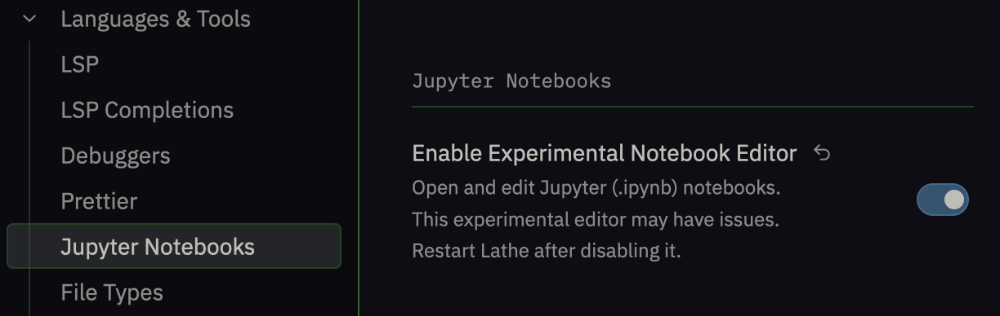

---

## Terminal, windows, and workspaces

### Additional windows for editors and terminals
Send an editor tab or a terminal into a second window from its tab context menu. With no second window open the entry is flat: **Open in New Window** for editors, **Move to New Window** for terminals. Once one exists, both turn into submenus (**Open in Window** and **Move to Window**) listing every open window on the same project, so a tab can be aimed at a specific one instead of always spawning another.

The two surfaces move differently, on purpose. An editor opens as another view of the same buffer, so both windows stay in sync. A terminal is transferred, not copied: the same view moves, which means the same process, scrollback, and input state. It leaves its source pane before it's added anywhere else, so it's never mounted in two windows at once.

These windows sit outside workspace persistence deliberately. They claim no database id, don't save bounds, and don't serialize their items, so they never come back as ghost windows on restart. `FloatingWindowManager` owns the close path: closing a window hands its terminals back to the panes they came from instead of killing them. One window can hold terminals drawn from several panes, so each transfer records its own source and a close returns them one at a time.

A few edge cases worth knowing about. A pane a terminal vacates closes if that empties it, because an empty pane draws no tab bar and would otherwise sit in the surviving window as a blank region with no way to dismiss it. A returning terminal only reveals the terminal panel if it belongs there, and skips a source pane the workspace no longer lays out, so a center terminal can't reopen an empty dock. A new window doesn't raise itself and an existing target might be behind the current one, so the destination gets activated either way. And activating an item no longer takes focus in `TerminalView`, leaving that to the pane, so a terminal finishing startup in the background can't pull you out of an open modal.

### Awaiting-input indicator
A return icon appears in the terminal tab and title bar when Claude Code or another interactive prompt is waiting on you, with the tooltip distinguishing a general prompt from a confirmation from a multiple-choice selection. The agent panel shows the same indicator when a thread is waiting, so an approval request doesn't sit unnoticed while you're working in another tab.

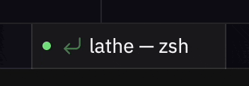

### Active terminal tab tint
Terminal tabs get a subtle green background when active, which makes them easy to pick out among editor tabs.

### Terminal focus fix
Switching to a terminal tab with ctrl+tab activates the cursor properly. No click into the terminal needed.

### Workspace groups with account binding
Save the set of projects you currently have open as a named **workspace group**, then reopen the whole thing in a new window later. A group can be bound to a saved collab account, in which case opening the group switches to that account first. Groups can also be written out to a portable `.lathe-workspace` file that travels with the project.

Commands (via the command palette):

- `workspace groups: save workspace group`
- `workspace groups: open workspace group`
- `workspace groups: update current workspace group`
- `workspace groups: rename current workspace group`
- `workspace groups: bind workspace group account`
- `workspace groups: unbind workspace group account`

### Per-window zoom
`Cmd +`, `Cmd -`, and `Cmd 0` zoom every piece of text in the active Lathe window together: editor, terminal, project panel, git panel, git graph, pull requests, agent panel, git commit editor, markdown preview. The zoom is scoped to that window, so two windows side by side can be zoomed independently. "Reset Zoom" in the menu and `Cmd +scroll-wheel` (when mouse-wheel zoom is enabled) behave the same way. Upstream Zed only zooms the editor with these keys and gives the agent panel and markdown preview their own independent zoom; Lathe folds all of that into the single window zoom. The persisted variants (the menu's `… (persisted)` items) still write to `settings.json` and apply globally.

### Multi-account collab switcher
Sign into more than one Zed Cloud account and switch between them from the avatar menu. Saved accounts are listed under **Accounts** by their GitHub username, with **Add Account…** and **Sign Out** actions.

### Copy collab link dialog
Generating a shareable collab link brings up a dialog for picking which saved account to link from. Useful if you work across personal and work Zed Cloud accounts.

---

## AWS profiles

A status-bar AWS profile selector, scoped per window, so two windows can target different accounts at once. Everything Lathe spawns (terminals, tasks) inherits the selected `AWS_PROFILE`. The menu only lists profiles you've used in this workspace and puts the rest behind **Show All Profiles**, and it polls SSO session status so an expired login is visible before a command fails on you. A project-local `.aws/config` takes over from the global one when there is one. The whole selector stays hidden unless the machine actually has AWS profiles configured.

That same menu creates a new SSO profile through a wizard, opens the AWS config file for editing, appends a `credential_process` wrapper profile for tooling that still expects SDK v2 credentials, and deactivates the current selection.
